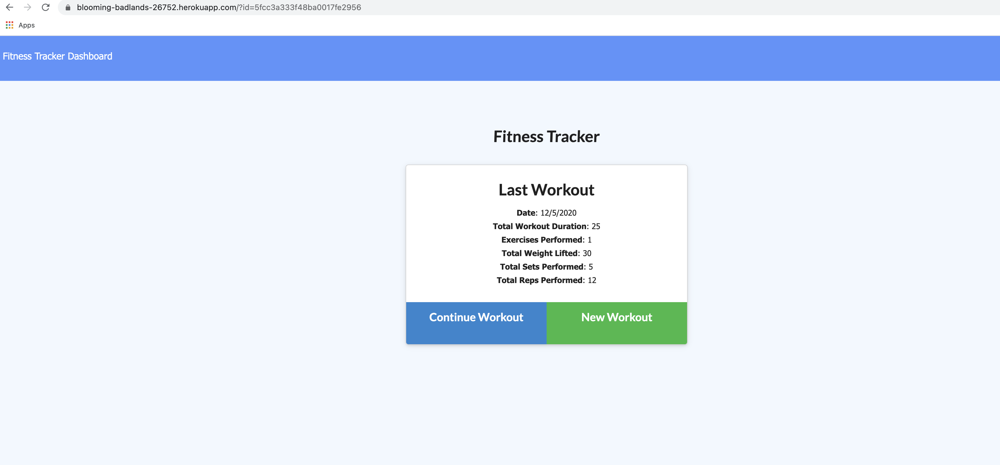
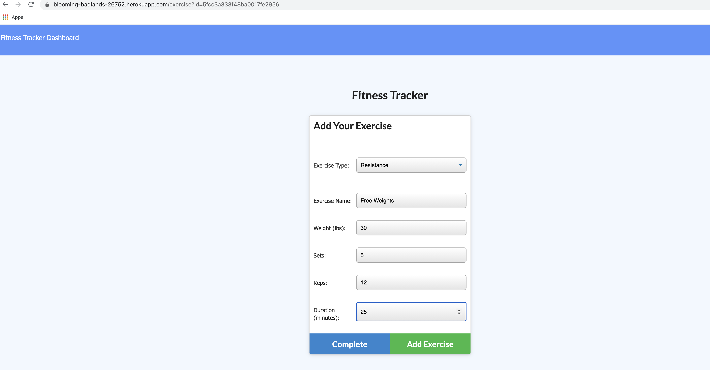
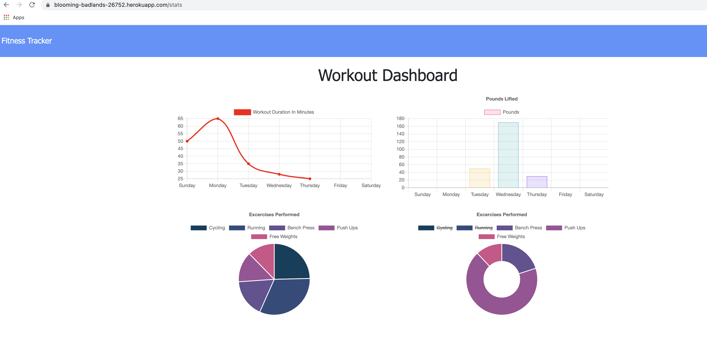

# Workout Tracker

## Description

My assignment was to create and build the back end code of a workout tracker application utilizing MongoDB Atlas, Mongoose, and routes with Express.  I was also tasked with deploying my app on Heroku.

## Table of Contents 

* [Deployment](#deployment)

* [Screenshots](#screenshots)

* [Author](#author)

## Deployment
### Heroku Link
[Click here](https://blooming-badlands-26752.herokuapp.com/)

## Screenshots

* **Landing Page**

* **New Workout Page**

* **Stats Page**

## Author

* **Eric Donohue**

### Other Projects

Please visit [edonohue8](https://github.com/edonohue8/) to see more of my projects.